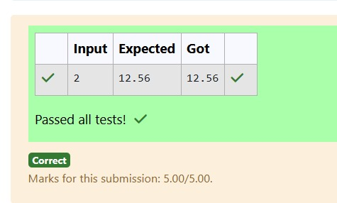

# Ex.No:2(B) METHODS

## QUESTION:
Create two methods:

Get the input for radius from the user.

double getArea(double r) → calculate the area and return the area(Don't print anything in this method).

void printArea(double area) → pass the calculated area to this method and print the area of a circle.

## AIM:
To develop a program that gets the radius of a circle from the user, calculates the area using a method getArea(double r), and displays the result using the printArea(double area) method.

## ALGORITHM :
1.	Start the program.
2.	Import the necessary package 'java.util'
3.	Create a class Area with a method calculateArea(double radius) to compute the area of a circle.
4.	In the main method, create a Scanner object to read the radius from the user.
5.	Call the calculateArea() method using the object and pass the radius as argument.
6.	Print the calculated area using System.out.printf() and end the program.


## PROGRAM:
 ```
/*
Program to implement a Methods using Java
Developed by: N V Chetan Satwik
RegisterNumber:212224240100
 import java.util.*;
public class Area{
    public double calculateArea(double radius){
        return 3.14*radius*radius;
    }
    public static void main(String[] args){
        Scanner sc = new Scanner(System.in);
        Area obj = new Area();
        double radius = sc.nextDouble();
        System.out.printf("%.2f",obj.calculateArea(radius));
    }
}
*/
```

## SOURCE CODE:


## OUTPUT:


## RESULT:
The program reads the radius from the user and displays the calculated area of the circle.
