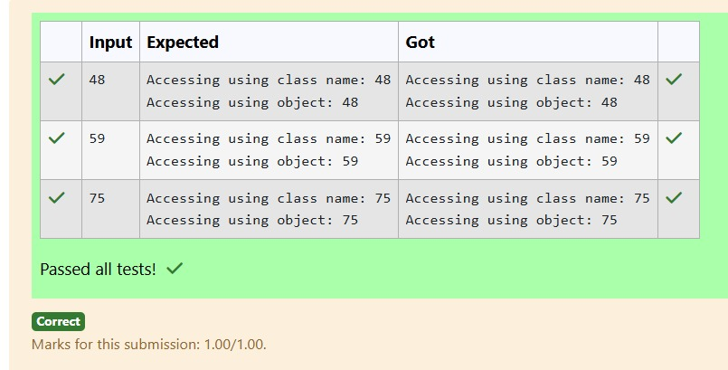

# Ex.No:2(D) VARIABLE SCOPE AND CONSTRUCTOR

## QUESTION:
Write a program to access a static variable using both class name and object.

## AIM:
To write a Java program that demonstrates how to access a static variable using both the class name and an object.

## ALGORITHM :
1.	Start the program.
2.	Import the necessary package 'java.util'
3.	Declare a class StaticVariableAccess with a static variable count.
4.	In the main method, create a Scanner object to read a value from the user.
5.	Assign the input value to the static variable count.
6.	Display the value of count using the class name and using an object, then end the program.

## PROGRAM:
 ```
/*
Program to implement a Variable scope and Constructor using Java
Developed by: N V Chetan Satwik
RegisterNumber: 212224240100
import java.util.Scanner;
public class StaticVariableAccess {
    static int count;  
    public static void main(String[] args) {
        Scanner scanner = new Scanner(System.in);
        count = scanner.nextInt();  
        System.out.println("Accessing using class name: " + StaticVariableAccess.count);

        StaticVariableAccess obj = new StaticVariableAccess();
        System.out.println("Accessing using object: " + obj.count);
    }
}  
*/
```

## SOURCE CODE:


## OUTPUT:



## RESULT:
The program successfully demonstrates accessing a static variable using both the class name and an object, and displays the entered value.
