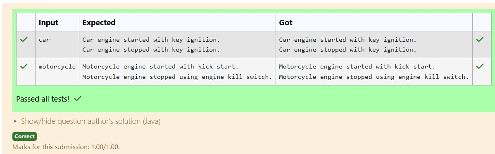

# Ex.No:3(b) POLYMORPHISM

## QUESTION:
Write a Java program to create a base class Vehicle with methods startEngine() and stopEngine(). Create two subclasses: Car and Motorcycle. Override the startEngine() and stopEngine() methods in each subclass to start and stop the engines differently.

Requirements:
Ask the user to select a vehicle type (Car or Motorcycle).

If it's not been Car or Motorcycle, display "Invalid vehicle type selected."
Based on the selection, call the appropriate overridden methods for startEngine() and stopEngine()

## AIM:
To develop a Java program using inheritance and method overriding to demonstrate different implementations of startEngine() and stopEngine() methods for Car and Motorcycle classes based on user input.

## ALGORITHM :
1.	Start the program.
2.	Import the necessary package 'java.util'
3.	Create a base class Vehicle with methods startEngine() and stopEngine().
4.	Create subclasses Car and Motorcycle that override these methods with their own engine start and stop messages.
5.	In the main method, read the vehicle type from the user using Scanner.
6.	Check the input and create the corresponding object (Car or Motorcycle) and call the overridden methods.
7.	If the input is neither Car nor Motorcycle, display "Invalid vehicle type selected." and end the program.


## PROGRAM:
 ```
/*
Program to implement a Polymorphism using Java
Developed by: N V Chetan Satwik
RegisterNumber: 212224240100
import java.util.Scanner;
class Vehicle {
    void startEngine() {
        System.out.println("Engine started.");
    }

    void stopEngine() {
        System.out.println("Engine stopped.");
    }
}
class Car extends Vehicle {
    @Override
    void startEngine() {
        System.out.println("Car engine started with key ignition.");
    }

    @Override
    void stopEngine() {
        System.out.println("Car engine stopped with key ignition.");
    }
}

class Motorcycle extends Vehicle {
    @Override
    void startEngine() {
        System.out.println("Motorcycle engine started with kick start.");
    }

    @Override
    void stopEngine() {
        System.out.println("Motorcycle engine stopped using engine kill switch.");
    }
}

public class VehicleTest {
    public static void main(String[] args) {
        Scanner sc = new Scanner(System.in);
        String type = sc.next().trim().toLowerCase();

        Vehicle vehicle;

        if (type.equals("car")) {
            vehicle = new Car();
            vehicle.startEngine();
            vehicle.stopEngine();
        } else if (type.equals("motorcycle")) {
            vehicle = new Motorcycle();
            vehicle.startEngine();
            vehicle.stopEngine();
        } else {
            System.out.println("Invalid vehicle type selected.");
        }

        sc.close();
    }
}

*/
```

## SOURCE CODE:


## OUTPUT:



## RESULT:
The program displays the appropriate engine start and stop messages for the selected vehicle type or shows an error message for an invalid input.
