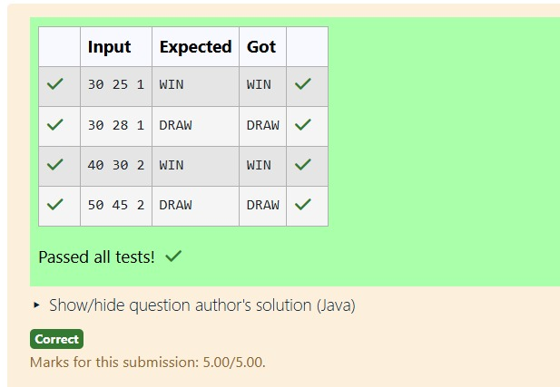

# Ex.No:3(D)    INTERFACE 

## QUESTION:
Each judge uses different criteria to score fighters. Based on points, the judge will declare “WIN”, “LOSE” or “DRAW”.

LenientJudge: WIN if diff ≥ 5, DRAW if < 5

StrictJudge: WIN if diff ≥ 10, DRAW if < 10

Input Format:

player1Score
player2Score
judgeType
player1Score, player2Score: integers

judgeType: 1 for LenientJudge, 2 for StrictJudge

Output Format:
WIN / LOSE / DRAW

## AIM:
To develop a Java program using abstraction where different judges (LenientJudge and StrictJudge) evaluate fighter scores and declare WIN, LOSE, or DRAW based on their scoring criteria.

## ALGORITHM :
1.	Start the program.
2.	Import the necessary package 'java.util'
3.	Read player1Score, player2Score, and judgeType using Scanner.
4.	Calculate the difference diff = player1Score - player2Score.
5.	If diff < 0, print "LOSE".
6.	If judgeType is 1 (LenientJudge), print "WIN" if diff ≥ 5, otherwise print "DRAW".
7.	If judgeType is 2 (StrictJudge), print "WIN" if diff ≥ 10, otherwise print "DRAW".


## PROGRAM:
 ```java
/*
Program to implement a Interface using Java
Developed by: N V Chetan Satwik
RegisterNumber:212224240100
import java.util.*;

public class Main {
    public static void main(String[] args) {
        Scanner sc = new Scanner(System.in);
        int player1Score = sc.nextInt();
        int player2Score = sc.nextInt();
        int judgeType = sc.nextInt();

        int diff = player1Score - player2Score;

        if (diff < 0) {
            System.out.print("LOSE");
        } else {
            if (judgeType == 1) {
                if (diff >= 5)
                    System.out.print("WIN");
                else
                    System.out.print("DRAW");
            } else if (judgeType == 2) {
                if (diff >= 10)
                    System.out.print("WIN");
                else
                    System.out.print("DRAW");
            }
        }
    }
}
*/
```

## SOURCE CODE:


## OUTPUT:



## RESULT:
The program evaluates the scores based on the selected judge type and displays WIN, LOSE, or DRAW accordingly.
