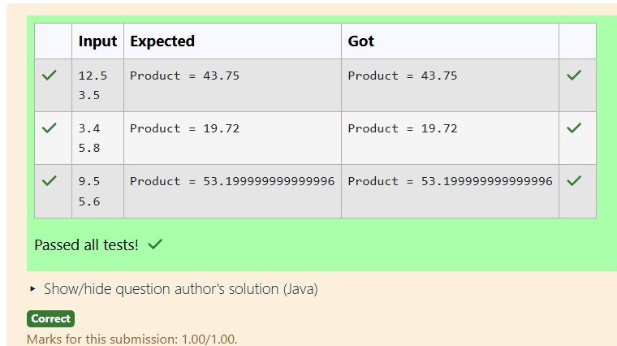

# Ex.No:3(F) WRAPPER CLASS

## QUESTION:
Convert a string to a double using Double.parseDouble() and multiply two numbers.

## AIM:
To write a Java program that converts string values to double using Double.parseDouble() and calculates the product of the two numbers.

## ALGORITHM :
1.	Start the program.
2.	Import the necessary package 'java.util'
3.	Create a Scanner object to read input from the user.
4.	Read two string values from the user.
5.	Convert the string values to double using Double.parseDouble().
6.	Multiply the two double values and store the result.
7.	Display the product and end the program.


## PROGRAM:
 ```java
/*
Program to implement a Wrapper Class using Java
Developed by: N V Chetan Satwik
RegisterNumber: 212224240100
import java.util.Scanner;

public class MultiplyDoubles {
    public static void main(String[] args) {
        Scanner scanner = new Scanner(System.in);
        String str1 = scanner.nextLine();

        String str2 = scanner.nextLine();
        double num1 = Double.parseDouble(str1);
        double num2 = Double.parseDouble(str2);

        double result = num1 * num2;
        System.out.println("Product = " + result);
        scanner.close();
    }
}
*/
```

## SOURCE CODE:


## OUTPUT:



## RESULT:
The program converts the given strings into double values and displays the product of the two numbers.
